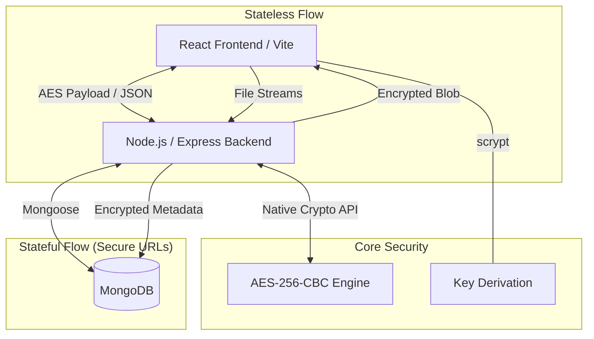

# ALLCRYPT

**ALLCRYPT** is an open, modern React/Node-stack encryption utility built for secure data transmission. It features military-grade encryption algorithms (AES-256, AES-192, AES-128) and a stunning premium UI with glassmorphism and adaptable dark/light mode aesthetics. 

## Features
- **Open Access**: No login or authentication required. Simply generate a key and encrypt.
- **Client & Server Integration**: Uses a modern React (Vite) frontend with a Node/Express backend that handles cryptographic buffering safely.
- **Multiple Algorithms**: Dynamically select between AES-128, AES-192, and AES-256.
- **Password-Derived Keys**: Utilizes `scrypt` to securely hash custom passwords into exact byte-length keys.
- **File Encryption**: Drag and drop any file to securely encrypt it using Node streams and `multer`.
- **Password Strength Meter**: Real-time visual feedback confirming key security and complexity.
- **QR Code Generation & Download**: Instantly generates scannable QR codes for encrypted text to share via mobile, including an option to download the QR code directly.
- **Interactive About Guide**: Includes a built-in Glassmorphism modal explaining fundamental encryption mechanics instantly to new users.
- **Secure URL Redirection**: Create password-protected, encrypted short links with optional expiration timers and "one-time access" (burn-after-reading) capabilities.
- **Light & Dark Themes**: Premium UI with a fully functional theme toggle and adaptable CSS variables for a seamless glassmorphism experience.

## System Architecture

ALLCRYPT operates on a hybrid architecture designed for both maximum privacy (stateless) and secure persistent sharing (stateful).



### Technical Design
- **Stateless Encryption**: Core text and file encryption tasks are handled in-memory using Node.js `crypto` streams. No data from these operations is ever persisted to a database.
- **Stateful Secure Links**: For the "Secure URL" feature, metadata is encrypted using a server-side `ENCRYPTION_SECRET` and stored in MongoDB with automatic TTL (Time-To-Live) expiration.
- **Cryptographic Standards**: Uses `AES-256-CBC` for encryption, `scrypt` for key derivation from user passwords, and `bcrypt` for secure storage of link-access passwords.
- **Performance**: Large file encryption is handled via Node.js **Read/Write Streams**, ensuring minimal memory footprint regardless of file size.

## Tech Stack
- **Frontend**: React.js, Vite, Vanilla CSS (Glassmorphism design), Framer Motion, Axios
- **Backend**: Node.js, Express.js, native `crypto` API

## Getting Started

### Prerequisites
Make sure you have Node.js installed on your local machine. (Note: The application is now fully stateless and MongoDB is no longer required).

### 1. Installation
Clone the repository and install dependencies for both the client and server.

```bash
# Install Server dependencies
cd server
npm install

# Install Client dependencies
cd ../client
npm install
```

### 2. Configuration
In the `server/` directory, ensure your `.env` file has the following configurations:
```env
PORT=5002
```

> [!TIP]
> **macOS Users**: If you encounter a `CORS` or `Connection Refused` error on port 5000, it is likely due to the "AirPlay Receiver" service. We recommend using port **5002** as configured above.

### 3. Running the Project
You will need two separate terminal windows.

**Terminal 1 (Backend):**
```bash
cd server
node index.js
```

**Terminal 2 (Frontend):**
```bash
cd client
npm run dev
```

The application will be automatically running on `http://localhost:5173`.

## Usage
1. Enter the plain text you wish to secure into the input field.
2. Select your desired encryption algorithm from the dropdown.
3. Click **Generate Random Key** (or type a memorable password yourself).
4. Click **Auto-Encrypt Data**.
5. Copy the combined output (IV + Ciphertext) alongside the password to share securely.

## License
Created as a final semester project. Open MIT License.
